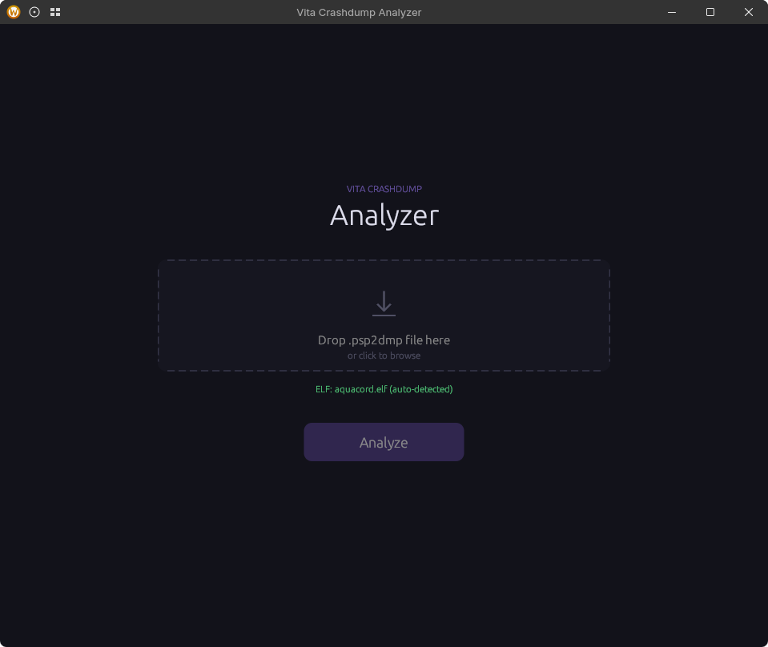
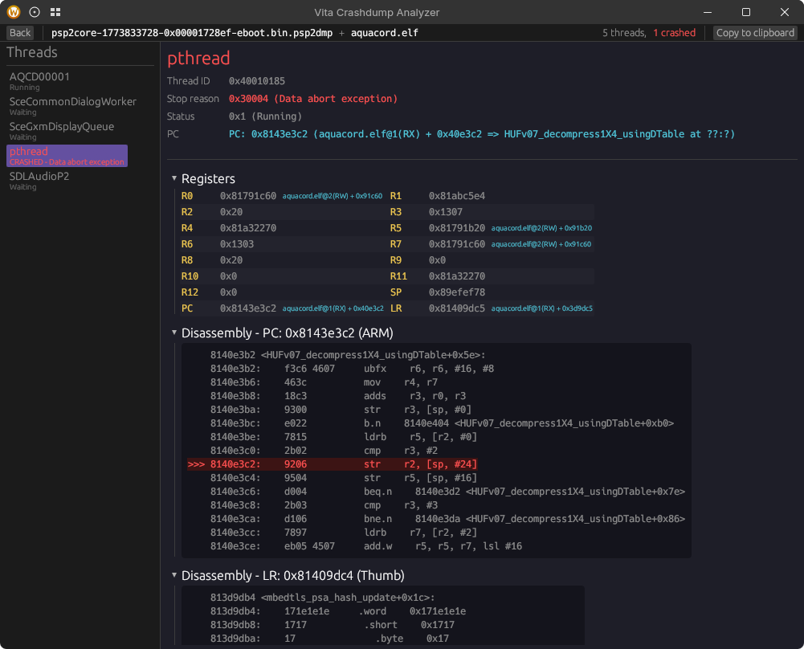
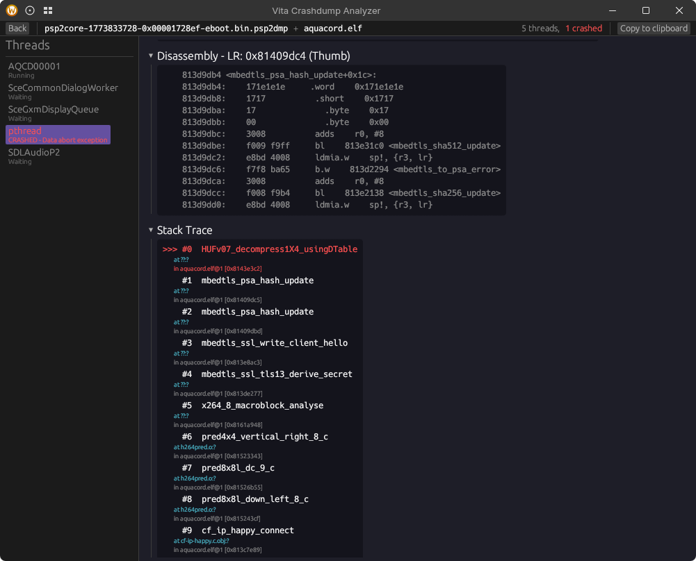

# vita-crashdump

PS Vita crashdump (`.psp2dmp`) analyzer. Parses coredump ELF files produced by the Vita on crash, resolves addresses to modules/symbols, reconstructs stack traces via ARM unwind tables, and disassembles around the crash site.

Both a CLI tool and a GUI (egui) are included. They produce identical analysis output.

<p>
  
  
  
</p>

## Features

- Parses MODULE_INFO, THREAD_INFO, THREAD_REG_INFO, STACK_INFO, and TTY_INFO notes
- Handles both gzip-compressed and raw `.psp2dmp` files
- Resolves addresses to module + segment + offset (e.g. `SceGxm@1(RX) + 0xaa2c`)
- Symbol resolution via `arm-vita-eabi-addr2line` (persistent subprocess, demangled)
- Disassembly around crash PC/LR via `arm-vita-eabi-objdump` (ARM + Thumb, no source interleave)
- Only disassembles app code — skips system modules (SceGxm, SceLibKernel, etc.) where we don't have the binary
- **ARM stack unwinding** via `.ARM.exidx` / `.ARM.extab` sections for accurate backtraces (falls back to heuristic stack scan when unwind info is unavailable)
- **Fault address** from ARM DFAR/IFAR registers — shows the exact memory address that caused a data/prefetch abort (e.g. `DFAR: 0x1f0` = null pointer + struct offset)
- **Per-thread stack usage** (peak and current) from STACK_INFO
- **TTY output** capture from TTY_INFO (console output at time of crash)
- 20+ stop reasons (data abort, prefetch abort, stack overflow, FPU/GPU exceptions, watchpoints, breakpoints, syscall errors, unrecoverable errors, etc.)
- 9 thread statuses (running, ready, standby, waiting, dormant, dead, etc.)
- Rust symbol demangling with crate hash cleanup (`serde_json[51fcb18d1cbbb693]` -> `serde_json`)
- File path shortening (strips toolchain/registry prefixes)
- GUI: Phosphor icons, drag & drop, auto ELF detection, copy-to-clipboard for sharing with others or LLMs

## Usage

### CLI

```sh
vita-crashdump <corefile.psp2dmp> <app.elf>
```

Output looks like:

```
=== THREAD "AQCD00001" <0x40010003> ===
Stop reason: 0x30004 (Data abort exception)
Status: 0x1 (Running)
PC: 0x810fb638 (aquacord.elf@1(RX) + 0x9f638 => core::ptr::read_volatile::<u32>)
Stack usage: 13728 / 36700 bytes (peak)
Fault address: DFAR: 0xdead0000

Stack Trace:
>>> #0  core::ptr::read_volatile::<u32>
        at core/src/ptr/mod.rs:2094
        in aquacord.elf@1 [0x810fb638]
    #1  aquacord::crashdump_test_inner
        at apps/aquacord/src/main.rs:1109
        in aquacord.elf@1 [0x810a90dd]
    #2  aquacord::crashdump_test_middle
        at apps/aquacord/src/main.rs:1113
        in aquacord.elf@1 [0x810a90ef]
    #3  aquacord::run
        at apps/aquacord/src/main.rs:742
        in aquacord.elf@1 [0x810b0489]
    #4  aquacord::main
        at apps/aquacord/src/main.rs:1123
        in aquacord.elf@1 [0x810b1a95]

Registers:
    R0   0xdead0000
    R1   0x3
    ...
    PC   0x810fb638 (aquacord.elf@1(RX) + 0x9f638)
    LR   0x810b43d1 (aquacord.elf@1(RX) + 0x583d1)

Disassembly around PC: 0x810fb638 (ARM):
    8109f636:   9801        ldr   r0, [sp, #4]
>>> 8109f638:   6800        ldr   r0, [r0, #0]
    8109f63a:   9003        str   r0, [sp, #12]
    ...
```

### GUI

```sh
# Build with GUI support
cargo build --release --features gui --bin vita-crashdump-gui

# Run (optionally pass a dump file to pre-load)
vita-crashdump-gui [corefile.psp2dmp]
```

The GUI auto-detects your ELF from `target/armv7-sony-vita-newlibeabihf/{debug,release}/`. The "Copy to clipboard" button exports the same text format as the CLI.

## Building

Requires VitaSDK tools on PATH (or `VITASDK` env var set) for symbol resolution and disassembly:
- `arm-vita-eabi-addr2line`
- `arm-vita-eabi-objdump`

Without these, the tool still works but won't resolve symbols or show disassembly.

```sh
# CLI only
cargo build --release

# CLI + GUI
cargo build --release --features gui
```

## How the stack trace works

The tool uses two strategies for stack trace reconstruction, preferring the accurate one:

### 1. ARM unwind tables (primary)

If the app ELF contains `.ARM.exidx` and `.ARM.extab` sections (which Rust/C++ binaries do), the tool performs proper frame-by-frame unwinding. It decodes ARM compact unwind opcodes to recover each frame's saved LR and SP, walking the call chain accurately. This handles relocation (runtime vs ELF addresses) automatically.

When the crash PC is in a system module (e.g. SceGxm), the unwinder starts from LR instead, since we only have unwind tables for the app binary.

### 2. Heuristic stack scan (fallback)

When unwind tables aren't available (no ELF provided, or the unwinder can't produce enough frames), the tool falls back to scanning the stack for values that point into executable (RX) segments. This is imperfect — some entries may be stale return addresses from earlier calls — but gives a useful picture of what was happening.

## Based on

Originally based on [vita-parse-core](https://github.com/xyzz/vita-parse-core) (Python). Coredump struct layouts and note types referenced from [vcp](https://github.com/isage/vcp) (C++). Rewritten in Rust with ARM unwinding, fault address extraction, demangling, and a GUI.
